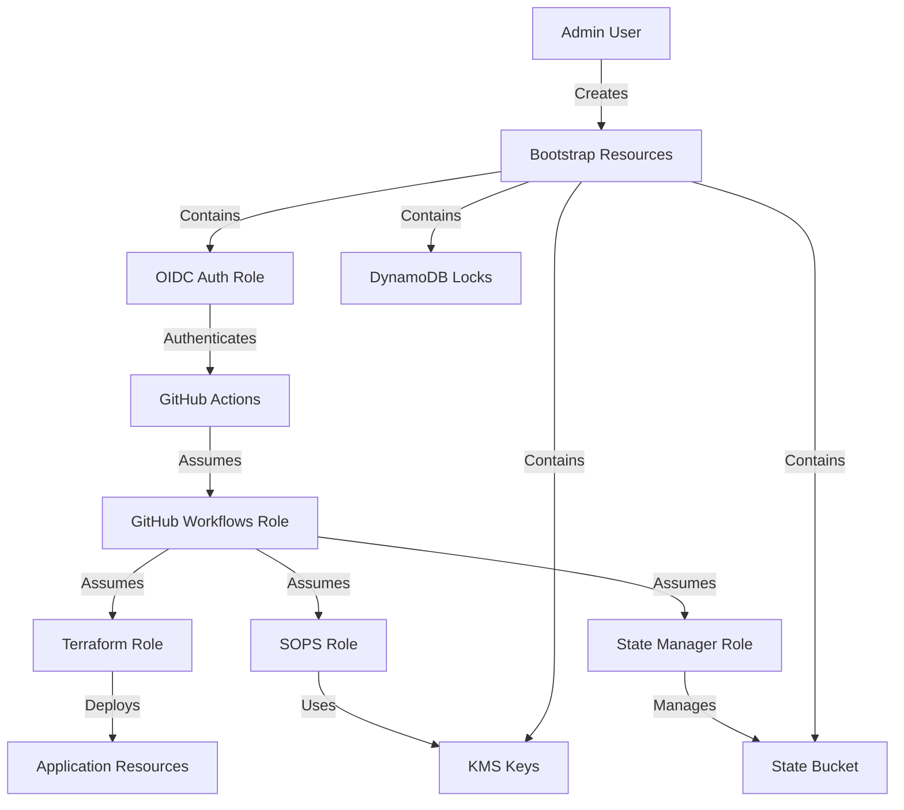
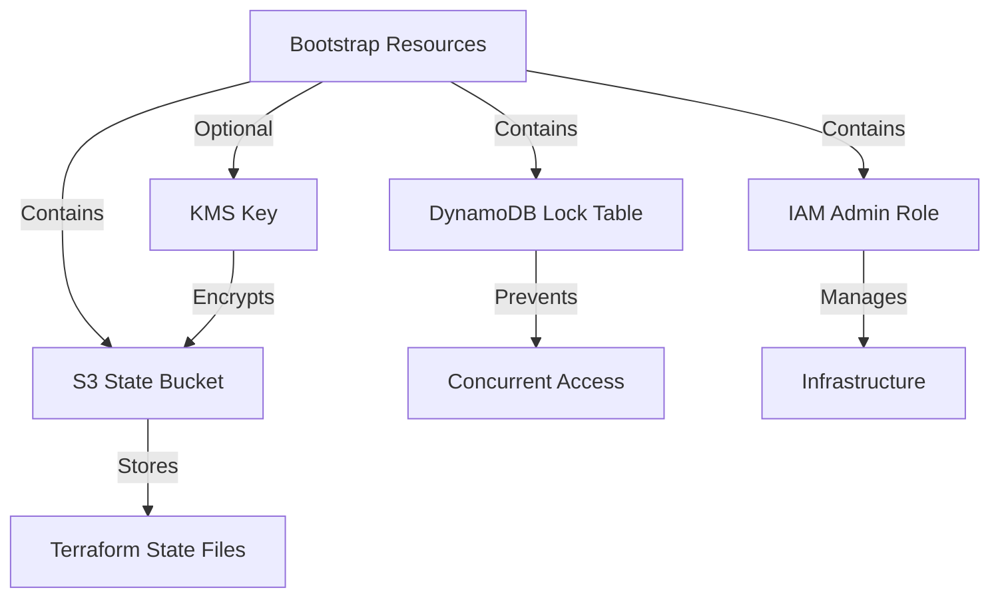
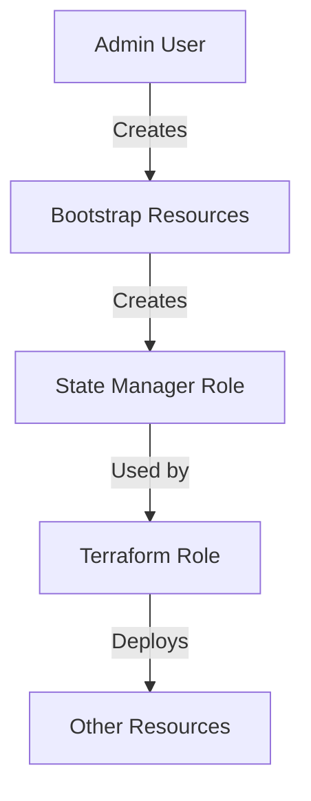
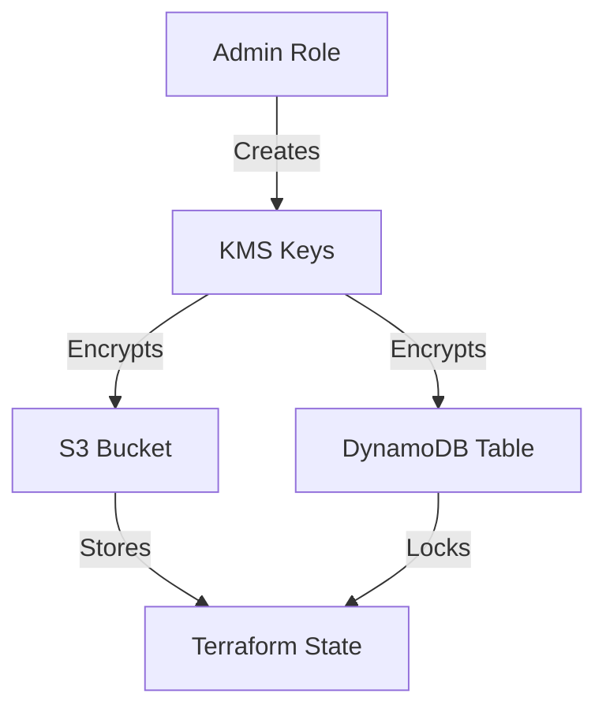
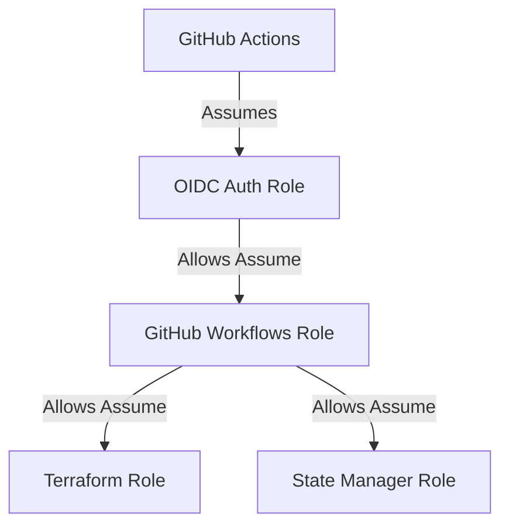
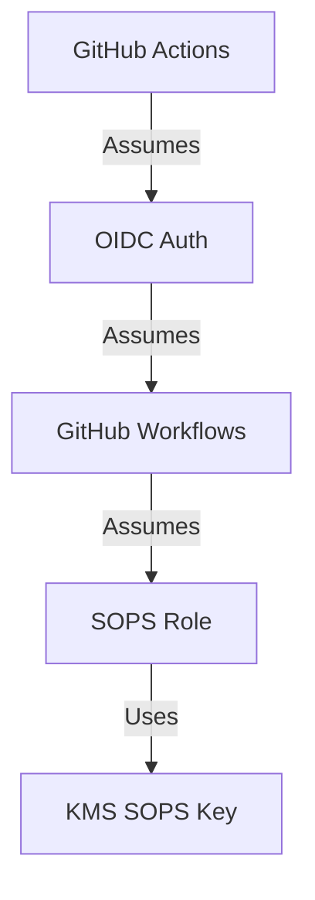
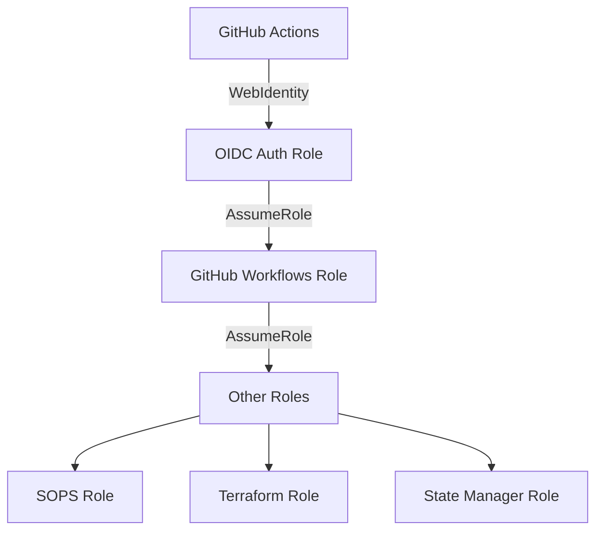

# Aidoc Home Assignment - This document is a work in progress.

This document aims to shed some light on why I chose plan and use it like so and in addition it's also a deployment guide.

Since there are many directories in the structure I will break it to pieces, starting from the repository root.

```
.
├── python
│   ├── order_retrieval
│   │   ├── code
│   │   │   └── __pycache__
│   │   └── code_test
│   │       └── tests
│   │           └── __pycache__
│   └── order_verification
│       ├── code
│       └── code_test
│           ├── order_verification
│           │   └── __pycache__
│           └── tests
│               └── __pycache__
```

The Python functions I've been instructed to write can be found in the python directory along with their tests.
In order to run the tests, simply browse into `<function_name>/code_test` and run:

```bash
python -m pytest tests/ -v
```

```bash
└── terraform
    ├── modules
    │   ├── dynamodb
    │   ├── ecr
    │   ├── github-oidc
    │   ├── iam-role
    │   ├── kms
    │   ├── lambda
    │   ├── s3
    │   ├── sqs
    │   ├── ssm
    └── states
```

Under `terraform` directory, you will find two directories;

1. `modules` - as its name suggests - all the Terraform modules that I wrote are there.
   ** to myself - add readme.md files there**

2. `states` directory - this is where you will find the structure of the environment.

When I started working on the project, I thought I'll do exactly what I was instructed to do, but as I started, I realized that I never had the opportunity to
design / architect a whole infrastructure from scratch and I figured that now it would be a good opportunity to do so.
I thought deeply about the the goals I'd like to achieve at the end of the work, and even though it might look a little complex at first sight, I think I came up with an infrastructure that is ready
for a company's growth and future.

```
└── states
    └── environments
        └── aws
            └── my-aws-account
                ├── _global
                │   ├── _bootstrap
                │   │   ├── dynamodb
                │   │   │   └── terraform-state-locks
                │   │   ├── github-oidc
                │   │   │   └── github-oidc-provider
                │   │   ├── iam-role
                │   │   │   └── sops
                │   │   ├── kms
                │   │   │   ├── sops-key
                │   │   │   └── terraform-state-key
                │   │   └── s3
                │   │       └── terraform-state
                │   ├── admin
                │   │   └── iam-role
                │   │       └── admin
                │   ├── github-actions-workflows
                │   │   └── iam-role
                │   │       ├── github-actions-workflows
                │   │       └── github-oidc-auth
                │   └── terraform
                │       └── iam-role
                │           ├── state-manager
                │           └── terraform
                ├── eu-north-1
                │   └── dev-stockholm-1
                │       ├── dynamodb
                │       │   └── orders
                │       ├── ecr
                │       │   └── order-retrieval
                │       ├── iam-role
                │       │   ├── retrieval_lambda_execution
                │       │   └── verification_lambda_execution
                │       ├── kms
                │       │   └── data-encryption
                │       ├── lambda
                │       │   ├── order-retrieval
                │       │   │   ├── lambda_source_code
                │       │   │   │   └── __pycache__
                │       │   │   └── tests
                │       │   │       └── __pycache__
                │       │   └── order-verification
                │       │       ├── lambda_source_code
                │       │       └── test_payloads
                │       ├── s3
                │       │   ├── order-verification-code
                │       │   └── ordering-system
                │       ├── sqs
                │       │   └── order-processor
                │       └── ssm
                │           └── managed
```

If it would be a real case scenario, I'd separate the `modules` and the `states` to two different repositories, but for the sake of the assignment the are directories.

`environments` is the top level of the `states` directory and below it you will find the `aws` directory.

I thought that today, for the assignment, I only manage one provider of resource - AWS, but in the real world I would probably manage resources by many more providers.

Under `aws` directory, you can find a representation of a single AWS account, but again, in a real world scenario, a company would probably have an organizational account which
contains more `accounts` (production, dev, qa, etc..), so this is where I would place the other AWS accounts.

In addition to that, you can find there the `parent terragrunt.hcl` file, the highest one in the hierarchy and it contains the `remote state s3 backend` and `provider` settings along with other common tags.

If I had more accounts, that's where I would define their account level variables.

Under each `account` directory, I created a directory per `AWS region`, for the assignment I created only 2 regional directories.

In each regional directory like that, you can find a `region.hcl` file where I placed variables that are region wide, the other directory in the level of the regions is also treated like a region, but in fact it's the path where I placed all the `_global` resources, resources that every region requires and since it's only "the beginning" of the so-called company I created, you could treat the `_global` directory like a management region.

Under each `region` directory, you can find `environment` directories like `dev-stockholm-1`, this structure allows you having a number of different environments under the same region if needed.

Under each environment directory, you can find the state directories of the modules that are active and configured in that environment and under these, the actual names of the managed resources and
their `terragrunt.hcl`.

# Environment Deployment Guide

This document covers the steps (in the correct order) to deploy the an environment.



### Bootstrap Resources Plan

1. S3 Bucket for Terraform state
2. DynamoDB table for state locking
3. IAM Admin Role (which you've already created)
4. KMS key for encryption (optional)

Here's the list as Mermaid diagram code:



These resources are considered "bootstrap" because they're the foundational infrastructure needed before Terraform can manage other resources effectively and securely.

The S3 bucket and DynamoDB table are particularly crucial as they enable:

- Remote state storage
- State locking
- Team collaboration
- State versioning



### Bootstrap Resource Creation Order

1. Create KMS keys first

   - Required for encrypting S3 bucket
   - Needed for DynamoDB encryption
   - Needed for Sops management

2. Create S3 bucket

   - Uses KMS key for encryption
   - Stores Terraform state

3. Create DynamoDB table
   - Uses same KMS key
   - Handles state locking

### Bootstrap Resources Build

1. **Verify Resources Created**

- [x] KMS key for encryption
- [x] S3 bucket for state storage
- [x] DynamoDB table for state locking

2. **Validation Steps**

```bash
cd /Users/itaig/src/aidoc_assignment/terraform/states/environments/aws/my-aws-account/_global/_bootstrap
terragrunt run-all plan
```

3. **Check Resources in AWS Console**

- KMS key with alias
- S3 bucket with versioning
- DynamoDB table with encryption

4. **Next Steps**

- Configure backend.tf to use these resources
  _. Test state locking
  _. Begin deploying application infrastructure

### Backend Configuration

1. **Steps**
   - Navigate to terragrunt repo root ("terraform/states/environments/aws") and edit terragrunt.hcl

- Uncomment generate block
- Configure S3 backend
- Add provider configuration
- Add necessary dependencies

1. **Verify**

```bash
cd terraform/states/environments/aws/my-aws-account/_global/_bootstrap
terragrunt run-all init
```

```hcl
terraform_version_constraint = "= 1.5.5"

locals {
  account_name = "my-aws-account"
  account_id   = "912466608750"
  region       = "eu-north-1"

  assignment_prefix = "aidoc-devops2-ex"

  common_vars = {
    assignment_prefix = local.assignment_prefix
    account_id        = local.account_id
    account_name      = local.account_name
    region            = local.region
  }
}

remote_state {
  backend = "s3"
  generate = {
    path      = "backend.tf"
    if_exists = "overwrite_terragrunt"
  }
  config = {
    bucket         = "${local.assignment_prefix}-terraform-state"
    key            = "${path_relative_to_include()}/terraform.tfstate"
    region         = "${local.region}"
    encrypt        = true
    kms_key_id     = "arn:aws:kms:${local.region}:${local.account_id}:alias/bootstrap/${local.assignment_prefix}-terraform-state-key"
    dynamodb_table = "${local.assignment_prefix}-terraform-state-locks"

    s3_bucket_tags = {
      Environment = "bootstrap"
      Project     = "ordering-system"
    }
  }
}

generate "provider" {
  path      = "provider.tf"
  if_exists = "overwrite_terragrunt"
  contents  = <<EOF
terraform {
  required_providers {
    aws = {
      source  = "hashicorp/aws"
      version = ">= 5.84.0, < 6.0.0"
    }
    sops = {
      source  = "carlpett/sops"
      version = ">= 0.7.2"
    }
  }
}
provider "aws" {
  region = "${local.region}"
}
provider "sops" {}
EOF
}

inputs = local.common_vars

```

4. **Validation**

```bash
terragrunt validate
aws s3api get-bucket-versioning --bucket aidoc-devops2-ex-terraform-state
aws s3api get-bucket-encryption --bucket aidoc-devops2-ex-terraform-state
terragrunt init
```

Press 'y' to proceed with the bucket updates.

Expected output:

Success! The configuration is valid.

## Next Steps

6. Begin application infrastructure deployment
7. Configure SOPS encryption
8. Set up CI/CD pipeline

## Resource Dependencies



### IAM Roles Deployment

1. Create State Manager Role

   - Manage S3 state bucket
   - Access DynamoDB locks
   - Use KMS key

2. Create Terraform Role

   - Full AWS access
   - Assume role from OIDC
   - KMS decrypt rights

3. Create GitHub Workflows Role
   - Limited AWS access
   - OIDC trust policy
   - Specific service permissions

### OIDC Authentication Flow

1. Role Structure:



2. Creation Order:

- OIDC Auth Role (trust OIDC provider)
- GitHub Workflows Role (trust OIDC Auth)
- Terraform Role (trust GitHub Workflows)
- State Manager Role (trust GitHub Workflows)

3. Permissions:

- OIDC Auth: Only AssumeRole permissions
- GitHub Workflows: Limited AWS access + AssumeRole
- Terraform: Full AWS access
- State Manager: State management only

### SOPS Role

1. **Role Purpose**

   - Decrypt secrets using KMS
   - Used by GitHub Workflows
   - Limited to SOPS key access

2. **Permission Flow**



3. **Implementation Steps**
   1. Add SOPS role to assumable roles in OIDC auth
   2. Create SOPS role with KMS permissions
   3. Update workflows role to assume SOPS role

### IAM Roles Usage Flow

1. **Authentication Flow**



2. **Use Cases**

```
| Role             | When to Use               | Example                                 |
| ---------------- | ------------------------- | --------------------------------------- |
| OIDC Auth        | Initial authentication    | `aws sts assume-role-with-web-identity` |
| GitHub Workflows | CI/CD operations          | Pushing artifacts, basic AWS operations |
| SOPS             | Secrets management        | Decrypt environment variables           |
| Terraform        | Infrastructure deployment | Create/update AWS resources             |
| State Manager    | State file operations     | Read/write terraform state              |
```

1. **Example Usage**

```yaml
# GitHub Actions Workflow Example
name: Deployment

jobs:
  deploy:
    permissions:
      id-token: write
      contents: read

    steps:
      # 1. Authenticate using OIDC
      - uses: aws-actions/configure-aws-credentials@v1
        with:
          role-to-assume: arn:aws:iam::${ACCOUNT_ID}:role/aidoc-devops2-ex-oidc-auth
          aws-region: eu-north-1

      # 2. Assume SOPS role to decrypt secrets
      - name: Assume SOPS Role
        run: |
          aws sts assume-role \
            --role-arn arn:aws:iam::${ACCOUNT_ID}:role/aidoc-devops2-ex-sops \
            --role-session-name sops-decrypt

      # 3. Assume Terraform role for deployment
      - name: Assume Terraform Role
        run: |
          aws sts assume-role \
            --role-arn arn:aws:iam::${ACCOUNT_ID}:role/aidoc-devops2-ex-terraform \
            --role-session-name terraform-deploy

      # 4. State Manager role used automatically by Terraform
      - name: Apply Terraform
        run: terragrunt apply
```

## Role Assume Examples - Role Flows

1. **OIDC Auth Role**

   ```mermaid
   graph TD
       A[GitHub Actions] -->|Authenticate| B[OIDC Auth Role]
       B -->|Assume| C[GitHub Workflows Role]
   ```

   ```yaml
   # filepath: .github/workflows/example.yml
   - name: Configure AWS credentials
     uses: aws-actions/configure-aws-credentials@v2
     with:
       role-to-assume: arn:aws:iam::$ACCOUNT_ID:role/aidoc-devops2-ex-github-oidc-auth
   ```

2. **GitHub Workflows Role**

   ```mermaid
   graph TD
       A[GitHub Workflows Role] -->|Push| B[ECR]
       A -->|Deploy| C[Infrastructure]
       A -->|Access| D[State Files]
   ```

   ```yaml
   # filepath: .github/workflows/example.yml
   - name: Assume Workflows Role
     run: |
       aws sts assume-role \
         --role-arn arn:aws:iam::$ACCOUNT_ID:role/aidoc-devops2-ex-github-actions-workflows \
         --role-session-name "GitHubActionsSession"
   ```

3. **State Manager Role**

   ```mermaid
   graph TD
       A[Developer] -->|Assume| B[State Manager Role]
       B -->|Manage| C[State Files]
       B -->|Lock| D[DynamoDB]
   ```

   ```bash
   # Local development
   export AWS_PROFILE=state-manager
   terraform state list
   terraform state show aws_lambda_function.example
   ```

4. **Terraform Role**

   ```mermaid
   graph TD
       A[Developer] -->|Assume| B[Terraform Role]
       B -->|Deploy| C[Infrastructure]
   ```

   ```bash
   # Local development
   export AWS_PROFILE=terraform
   terraform plan
   terraform apply
   ```

5. **SOPS Role**
   ```mermaid
   graph TD
       A[Developer/CI] -->|Assume| B[SOPS Role]
       B -->|Decrypt| C[Secrets]
   ```
   ```bash
   # Local development
   export AWS_PROFILE=sops
   sops -d secrets.yaml
   ```
